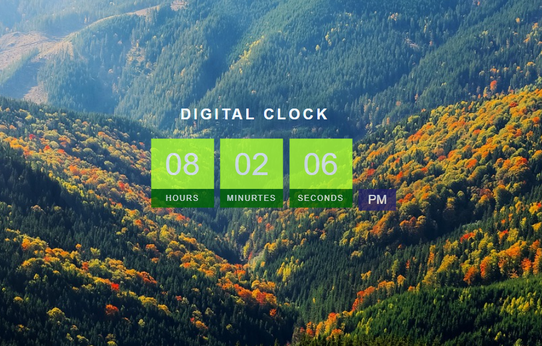

# Digital Clock

A simple digital clock created using HTML, CSS, and JavaScript.

## Features

- Displays current time in hours, minutes, and seconds
- Updates in real-time
- Clean and modern interface
- Responsive design that works on different screen sizes

##  Technologies Used

- HTML5
- CSS3
- JavaScript

## Contributing

Contributions are welcome! If you'd like to improve this project:

1. Fork the repository

2. Create your feature branch 

3. Commit your changes 

4. Push to the branch 

5. Open a Pull Request

## Usage

After opening the HTML file, the digital clock will automatically start displaying the current time and update every second.

## License

This project is open source and available under the .[MIT](https://choosealicense.com/licenses/mit/)


## Screenshot




## Installation

Clone this repository:
   ```bash
   git clone https://github.com/tafadzwamatsikidze/digital-clock.git
    
